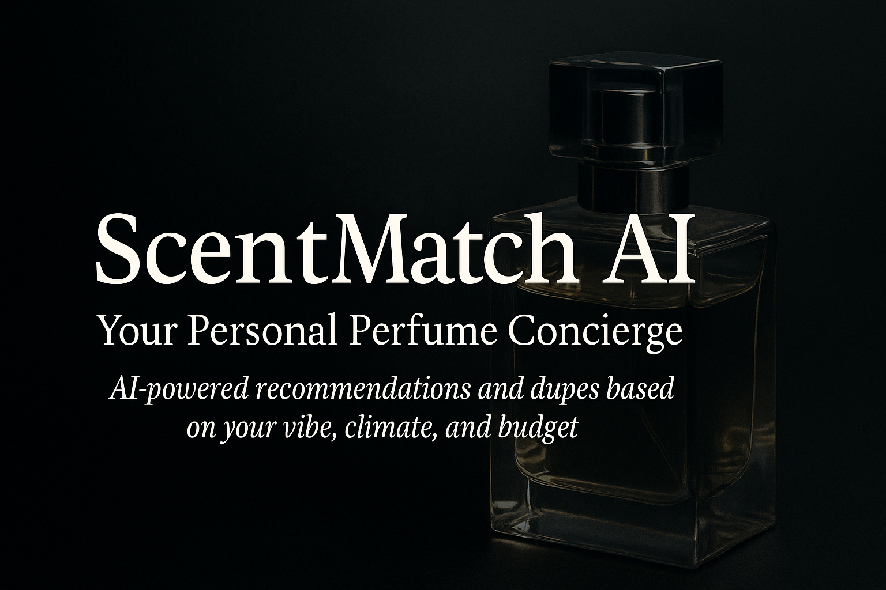

# 🌸 ScentMatch AI – Your Personal Perfume Concierge

An ADK-powered intelligent agent that recommends perfumes, finds dupes, and gives usage tips based on **vibe, climate, occasion, and budget**.

<p align="center">
  
</p>

---

## 🔗 Quick Links

- 📘 **Kaggle Notebook**  
  https://www.kaggle.com/code/abydanielvarghese/scentmatch-ai-your-personal-perfume-recommender

- 🎥 **Demo Video (Notebook walk-through)**  
  https://drive.google.com/file/d/1mTsPiGsLvM7zjGpsKCqkYSOb63MwKQHK/view

- 🏆 **Kaggle Competition Write-up**  
  https://www.kaggle.com/competitions/agents-intensive-capstone-project/writeups/scentmatch-ai-intelligent-perfume-recommendation

---

## 💡 What ScentMatch AI Does

Perfume shopping is confusing – hundreds of fragrances, different performance in hot vs cold weather, and designers that are way overpriced.

**ScentMatch AI acts like your fragrance-obsessed friend:**

- Suggests perfumes based on:
  - 🌡️ **Climate** – hot / humid / cold / winter
  - 🎭 **Vibe** – fresh, woody, sweet, office, sexy, cozy, clubbing
  - 🎯 **Occasion** – university, party, gym, date night, office
  - 💸 **Budget** – budget / designer / high / luxury
- Finds **cheaper alternatives (dupes)** for hyped expensive fragrances  
- Gives **usage tips** – sprays, longevity expectations, where/when to wear
- Works as both:
  - a **Kaggle notebook agent**, and  
  - a **Streamlit web app** you can chat with in a browser

---

## ✨ Main Features

### 🔍 1. Smart Perfume Recommendations (`recommend_perfumes`)

The agent filters a curated catalog using:

- Gender (masculine / feminine / unisex)
- Season (summer, winter, all-season etc.)
- Occasion (daily use, dates, club, office)
- Vibe (fresh, woody, sweet, cozy, blue, vanilla, etc.)
- Soft budget cap (budget → luxury)

It scores matches by **price + projection**, then returns the best 3–5 options.

---

### 🪞 2. Dupe Finder (`find_alternative`)

Given a reference fragrance (e.g. **Creed Aventus**, **Bleu de Chanel**, etc.), it:

- Tries to find cheaper perfumes with **similar vibe tags**
- Prefers:
  - lower price
  - overlapping “vibe” keywords
- Falls back to popular budget options if the reference isn’t in the mini catalog.

---

### 💡 3. Usage Tips Tool (`get_usage_tips`)

For a chosen perfume, the tool explains:

- Recommended sprays based on **projection** and **climate**
- Rough longevity expectations
- How long a **100 ml bottle** might last at that spray rate
- Extra notes like:
  > “These are community-style estimates, not lab-perfect numbers.”

---

### 🧾 4. Catalog-Backed Description (`describe_perfume`)

Returns a structured profile with:

- Brand + name  
- Vibe tags (fresh / vanilla / woody / fruity / etc.)  
- Seasons & occasions where it shines  
- Strength, projection, longevity  
- Price level & approximate USD price  
- A link to the official product page

---

## 🧠 Architecture

### Core Pieces

- **Perfume Catalog** – a hand-curated list of popular designer + budget frags  
  (Creed Aventus, CDNIM, Dylan Blue, Asad, Yara, Cedrat Boise, etc.)
- **Tools**
  - `recommend_perfumes`
  - `find_alternative`
  - `get_usage_tips`
  - `describe_perfume`
- **Main Agent – `scentmatch_ai`**
  - Uses the tools instead of hallucinating new perfumes
  - Asks at most **two clarifying questions** before recommending
- **Coach Agent – `coach_agent`**
  - A small sub-agent that rewrites the final answer to be clearer & friendlier

### Tech Stack

| Tech                                | Role                                         |
|-------------------------------------|----------------------------------------------|
| **Google ADK (Agents Development Kit)** | Agent + tools + runner                      |
| **Gemini 2.5 Flash-Lite**          | LLM powering conversations & reasoning       |
| **Streamlit**                      | Web UI chat interface                        |
| **Python**                         | Core implementation                          |
| **Kaggle Notebook**                | Original experimentation & evaluation        |

---

## 📂 Repo Structure

```bash
ScentMatch-AI/
│
├─ app.py                      # Streamlit web UI + ADK agent
├─ requirements.txt            # Python deps (google-adk, google-genai, streamlit, etc.)
├─ README.md                   # You are here
│
├─ assets/
│   ├─ banner.png              # Banner for README
│   └─ image.png               # Screenshot from notebook / UI
│
└─ scentmatch-ai-your-personal-perfume-recommender.ipynb
    # Original Kaggle notebook (logic matches the web app tools)
````

> The **tool logic in `app.py` is kept in sync with the notebook**, so behaviour is consistent whether you use Kaggle or the Streamlit UI.

---

## 📀 How to Run the Web App Locally

### 1️⃣ Clone the repo

```bash
git clone https://github.com/aby639/ScentMatch-AI-.git
cd ScentMatch-AI-
```

### 2️⃣ Create a virtual environment (recommended)

```bash
python -m venv .venv
# Windows:
.venv\Scripts\activate
# macOS / Linux:
source .venv/bin/activate
```

### 3️⃣ Install dependencies

```bash
pip install -r requirements.txt
```

### 4️⃣ Set your **Google AI API key**

**Windows PowerShell**

```bash
$env:GOOGLE_API_KEY="YOUR_API_KEY_HERE"
```

**macOS / Linux**

```bash
export GOOGLE_API_KEY="YOUR_API_KEY_HERE"
```

(You can get the key from Google AI Studio.)

### 5️⃣ Run Streamlit

```bash
streamlit run app.py
```

Then open the URL printed in the terminal (usually `http://localhost:8501`).

---

## 🖥 Using the Streamlit Web UI

Once the app is running, you can try prompts like:

* `Daily fresh fragrance for a guy in UK winter under 100$`
* `Give me a romantic vanilla vibe scent for dates under 60$`
* `Cheaper alternative to Creed Aventus`
* `How many sprays of Lattafa Asad in cold weather?`
* `Describe Versace Dylan Blue and when to wear it`

The left sidebar shows **tool call counts**, fallbacks, and error metrics.

---

## 📒 How to Use the Kaggle Notebook Version

1. Open the notebook on Kaggle (link in Quick Links above).
2. Add your API key in Kaggle **Secrets**.
3. Run all cells.
4. Use the helper function (or UI cell) to chat with the agent.
5. The behaviour and tools mirror the Streamlit version.

---

## ☁️ Optional – Deploy to Streamlit Community Cloud

1. Push `app.py`, `requirements.txt`, `README.md`, and `assets/` to GitHub (public repo).

2. Go to **[https://share.streamlit.io](https://share.streamlit.io)** and log in with GitHub.

3. Click **“New app”** → select this repo.

4. Set:

   * Branch: `main`
   * File: `app.py`

5. In the app **Settings → Secrets**, add:

   ```toml
   GOOGLE_API_KEY = "YOUR_API_KEY_HERE"
   ```

6. Click **Deploy**.
   Streamlit will build the app and give you a public URL you can share in your CV / portfolio.

---

## 🔮 Future Upgrades

If this becomes a full product, next steps could be:

* Larger catalog pulled from APIs / Fragrantica-like data
* Embedding-based similarity search for niche perfumery
* User accounts + “fragrance wardrobe” history
* Multi-language support (Malayalam / Hindi / etc.)
* Mobile app front-end powered by this backend

---

## 👤 Author

**Aby Daniel Varghese**
Built during the **5-Day OpenAI × Kaggle Agents Intensive**, later upgraded with a full web UI using Streamlit + Google ADK.

